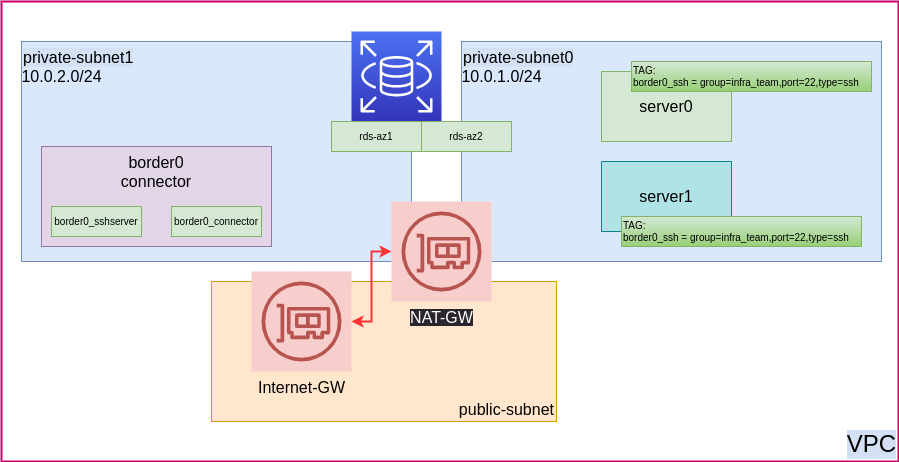

## Our Diagram

<p align="center">
    
</p>


## Environment prep and assumptions
Before we start we need to make sure our environment is set up right.
We will require a functioning terraform with AWS access as well as border0 cli tool
1. border0 CLI tool, if you don't have it installed yet please go to our [download page](https://www.border0.com/download)
2. terraform, we use SSO and profiles to manage our AWS access. For the demo we created ourselves a "dev" aws cli profile
In case you dont please comment out ``profile`` variable from ``provider "aws" { }`` section in the main.tf file
3. login and refresh your credentials, this applies to terraform and border0

## (pre-requisite) Terraform
This demo relies on AWS access and functioning terraform, please check if it runs
just a reminder, you can define your access using env variables
```
export AWS_ACCESS_KEY_ID="anaccesskey"
export AWS_SECRET_ACCESS_KEY="asecretkey"
export AWS_REGION="us-west-2"
export AWS_DEFAULT_REGION="us-west-2"
```
or with SSO provider, and profiles if you have those
```
aws --profile=dev sso login
export AWS_PROFILE=dev
```
more info on terraform aws provider [docs](https://registry.terraform.io/providers/hashicorp/aws/latest/docs)

## running the demo
we are going to login into border0:
```
border0 login
border0 account show
```

commands:
```
terraform init

terraform apply \
 -var="aws_region=us-west-2" \
 -var="border0_token=$(cat ~/.border0/token)" \
 -var="border0_org_cert=$(border0 organization show | grep ecdsa-sha2-nistp256 | awk '{print $5,$6}')"
```
Once terraform runs will login to our org as client

```
border0 client login
```
We sohuld see the connector SSH socket as well as client instances(if provisioned)

```
border0 client ssh -l ubuntu
```

### Cleanup
As with all things fun we need to leave things clean and neat once we're done.
```
terraform destroy
```
will delete all demo resources

### Terraform variables
there are few variables we can use to control our TF deployment
- "aws_region" determines AWS regiou to use, default is "us-west-2"
- "empty_ec2_metadata" sets ec2 metadata on connector to empty, default "false". In case we wish to wipe the border0 token from first terraform run.
- "border0_token" our temporary border0 token used for provisioning
- "border0_org_cert" our border0 organization cert, this is required for clients SSH configuration. More info on our [docs page](https://docs.border0.com/docs/securing-access-to-an-ssh-server#step-2----start-and-configure-the-openssh-server-for-testing)
- "client_compute_count" number of EC2 clients instances to spin up, default "2" but you can spin up more

the potentially full variable tf command would look like this:
```
terraform apply \
 -var="aws_region=ap-southeast-2" \
 -var="empty_ec2_metadata=false" \
 -var="border0_token=$(cat ~/.border0/token)" \
 -var="border0_org_cert=$(border0 organization show | grep ecdsa-sha2-nistp256 | awk '{print $5,$6}')" \
 -var="client_compute_count=5"
```